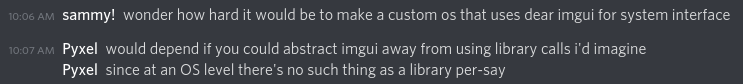

# building

install zig, qemu

clone with submodules

`cd src/deps/genimage`, `./autogen.sh`, `./configure`, `make`

`zig build run`

# plan

- https://github.com/hairymnstr/gristle
- echfs (follow readsector tutorial)
- start supporting user level programs
  - load and run a program off the filesystem and handle syscalls
    - the zig std has an elf parser
  - temporary syscalls for:
    - memory allocation
    - memory deallocation
    - printing an array to the uart
- do fun stuff
  - syscalls for:
    - fetching a service
    - dropping a service
    - performing an ipc, something used internally by services
  - root service
    - stuff for eg:
      - allocating memory
      - deallocating memory
      - printing an array to the uart
      - reading and writing files
      - registering services
      - spawning programs with access to a specified list of services

plan:

do both of those things:

- imgui system interface (not dear imgui, instead the same imgui I'm using in threadimgui)
- os-level libraries (like dynamic linking but better)
